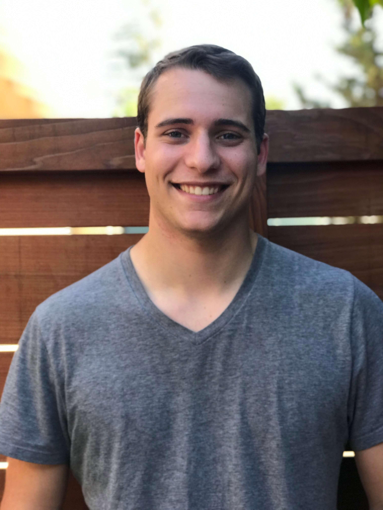
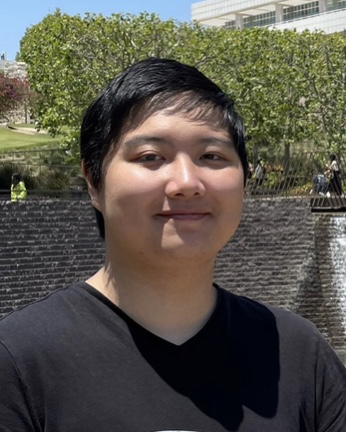
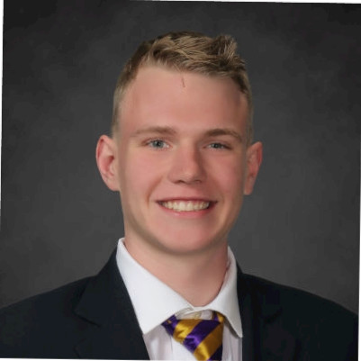
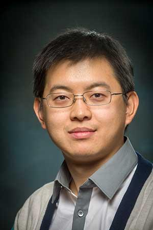

# 🌐 About The Project
Astraeus-Library originated as a senior project at San Jose State University, collaboratively developed over two semesters by a dedicated team of three students. This initiative was divided into two pivotal phases, with the initial semester focusing primarily on crafting the hardware, followed by a subsequent semester dedicated to the software development aspect.

During the course of its inception, our team had the opportunity to work closely with libhal, a collaborative effort that significantly contributed to the success and refinement of the project. This partnership was instrumental in navigating through the complexities and challenges that emerged during the development process, providing valuable insights and support that shaped Astraeus-Library into its current form.

## 🔄 Project Phases
Hardware Development Phase: The first semester of the project was devoted to the intricate process of hardware development. This phase entailed rigorous research, planning, and implementation to construct a robust hardware foundation for Astraeus-Library, ensuring its reliability and efficiency in performing its designated functions.

## 🔩 Hardware Development Phase
The first semester of the project was devoted to the intricate process of hardware development. This phase entailed rigorous research, planning, and implementation to construct a robust hardware foundation for Astraeus-Library, ensuring its reliability and efficiency in performing its designated functions.

## 💻 Software Development Phase
With a solid hardware base in place, the second semester was utilized for software development. This crucial phase involved coding, testing, and refining the software components to work seamlessly with the developed hardware, ultimately creating a cohesive and functional system.

## 🤝 Collaborative Effort
Engaging with libhal during the development process enriched our project with a wealth of knowledge and expertise in the field. Their consistent support and guidance played a pivotal role in overcoming technical hurdles and implementing best practices, resulting in a project outcome that not only met but exceeded our initial expectations.

## 👥 Team Members
### Adrien Carrou

    
    
Specialized in firmware and electrical, Adrien brought his extensive knowledge and skills to writing platform and device drivers as well as helping design the pcb.

### Michael Xiao

    
    
Specialized pcb design, Michael contributed significantly to the pcb design, ensuring its ease of use and reliability.

### Michell Sayer

    
    
Specialized in firmware development, Michell was instrumental in writing device and platform drivers, dedicating his efforts to perfecting the software components of the project.

## 🎓 Advisors

### Khalil Estell

    
    
As a co-advisor, Khalil provided invaluable guidance and support throughout the software and hardware development process, ensuring the successful completion of the project.

### Kaikai Liu

    
    
As an advisor, Kaikai offered valuable insights and feedback that helped us navigate through the complexities of the project.

## 🙏 Acknowledgements
We extend our gratitude to San Jose State University and libhal for their unwavering support and resources that were invaluable to the successful completion of Astraeus-Library. Special thanks also go to our mentors, advisors, and everyone who contributed their time and expertise to bring this project to fruition. We would firstly like to thank our co-advisor **Khalil Estell** for the tremendous amount of support and guidance he provided throughout the project. We would also like to thank our advisor **Kaikai Liu** for his valuable insights and feedback that helped us navigate through the complexities of the project.