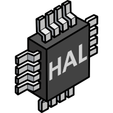

##  Astraeus Packages
<table>
  <tr>
    <th>
      
Repo

    </th>
    <th>
      
CI State

    </th>
    <th>
      
Coverage

    </th>
    <th>
      
Latest Version

    </th>
  </tr>

  <!-- <tr>
    <td>
      <a href="https://github.com/Astraeus-I/telemetry-recorder">Astraeus-I/telemetry-recorder</a>
    </td>
    <td>
      
    </td>
    <td>
      
    </td>
    <td>
      
    </td>
  </tr> -->

  <tr>
    <td>
      <a href="https://github.com/Astraeus-I/telemetry-recorder/" target="_blank">Astraeus-I/telemetry-recorder</a>
    </td>
    <td>
      
    </td>
    <td>
      
    </td>
    <td>
      
    </td>
  </tr>

  </table>

##  Libhal Packages
  <table>
  <tr>
    <th>
      
Repo

    </th>
    <th>
      
CI State

    </th>
    <th>
      
Coverage

    </th>
    <th>
      
Latest Version

    </th>
  </tr>
  
  
  
  <tr>
    <td>
      <a href="https://github.com/libhal/libhal-util/" target="_blank">libhal/libhal-util</a>
    </td>
    <td>
      
    </td>
    <td>
      
    </td>
    <td>
      
    </td>
  </tr>

  <tr>
    <td>
      <a href="https://github.com/libhal/libhal/" target="_blank">libhal/libhal</a>
    </td>
    <td>
      
    </td>
    <td>
      
    </td>
    <td>
      
    </td>
  </tr>  
  
  <tr>
    <td>
      <a href="https://github.com/libhal/libhal-lpc40/" target="_blank">libhal/libhal-lpc40</a>
    </td>
    <td>
      
    </td>
    <td>
      
    </td>
    <td>
      
    </td>
  </tr>

  <tr>
    <td>
      <a href="https://github.com/libhal/libhal-icm/" target="_blank">libhal/libhal-icm</a>
    </td>
    <td>
      
    </td>
    <td>
      
    </td>
    <td>
      
    </td>
  </tr>

  <tr>
    <td>
      <a href="https://github.com/libhal/libhal-mpl/" target="_blank">libhal/libhal-mpl</a>
    </td>
    <td>
      
    </td>
    <td>
      
    </td>
    <td>
      
    </td>
  </tr>

  <tr>
    <td>
      <a href="https://github.com/libhal/libhal-neo/" target="_blank">libhal/libhal-neo</a>
    </td>
    <td>
      
    </td>
    <td>
      
    </td>
    <td>
      
    </td>
  </tr>

  <tr>
    <td>
      <a href="https://github.com/libhal/libhal-xbee/" target="_blank">libhal/libhal-xbee</a>
    </td>
    <td>
      
    </td>
    <td>
      
    </td>
    <td>
      
    </td>
  </tr>

  </table>

!!! note
    If CI status is not showing or is failing, please check the CI status on the respective repository. You can also ask a developer on the [Libhal Discord](https://discord.gg/HXetQHqDHr) or [Astraeus Discord](https://discord.gg/7H8FzkXEgZ) servers for assistance.
