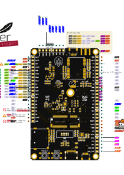

# 🔩 Hardware Details

To connect the Astraeus-I board with other devices, start by referencing the pinout diagram or the clearly labeled pins on the board itself. This will guide you in identifying the exact pins required for your connection. Once you have this information, match these pins with the corresponding ones on the device you're connecting to, using its pinout diagram as a reference. The Astraeus-I board is equipped with a variety of features including a 9 DOF IMU (ICM-20948), a Barometer (MPL3115A2), GPS (Neo-m9n), an SD Card slot, and it even supports the installation of an xbee radio module. Another key feature of this board is its micromod connector, which allows for easy swapping of the microcontroller, adding a layer of versatility to your projects.

### 📌 Pinout Diagram

### 🛠️ Board Specifications
- **Dimensions**
    - 52 mm x 85 mm
    - Horizontal Mounting Hole Distance: 46.1 mm
    - Vertical Mounting Hole Distance: 78.87 mm
- **Weight**
    - 22 grams (without header pins)
- **Power**
    - Supply voltage:  5V
    - Operating current: 200mA

!!! note
    For detailed information on the Astraeus board's schematic and board layout, refer to the <a href="https://github.com/Astraeus-I/Astraeus-I-Board" target="_blank">Astraeus-I Board repository</a>
