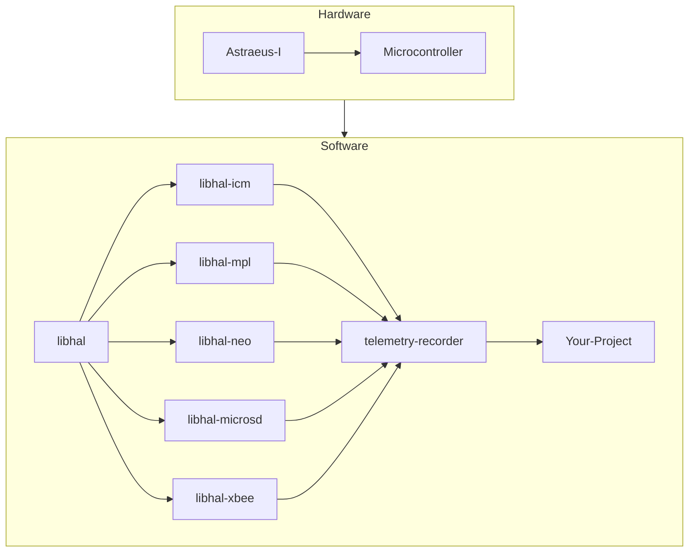

# 💻 Software Details

The board’s software includes device drivers for onboard devices, board application tools. Device drivers facilitate interaction with the onboard devices and are utilized by the board application tools. The telemetry recorder, a pivotal tool within the suite, captures data from the devices, offering options to either save this data to an SD card or transmit it through a radio module if one is present on the board. Concurrently, the board application tools empowers users to run custom applications on the board. These applications can manipulate the onboard devices and execute custom actions, providing a versatile foundation for developing your own applications.

Here is a diagram of the software architecture of the board:

To get a better understanding of the libhal software organization visit the <a href="https://libhal.github.io/2.2/contributor_guide/organization/#target-libraries" target="_blank">libhal organization</a>.