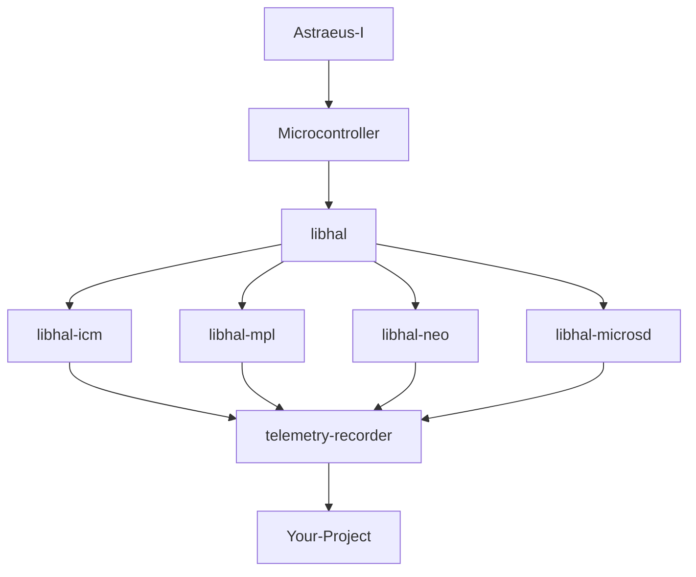

# 📖 User Guide
The Astraeus-I board is built to be modular in hardware and software. It includes a micromod which is a small micropressor board that can be switched out to the microcontroller of your choice. The board also includes a variety of sensors and peripherals that can be used for a variety of applications designed for avionic systems. The onboard devices include:

- 9 DOF IMU (ICM-20948)
- Barometer (MPL3115A2)
- GPS (Neo-m9n)
- SD Card

The boards software comprises of device drivers for each of the onboard devices, a telemetry recorder, and a board application package. The device drivers are used to interface with the onboard devices and are used by the telemetry recorder and board application package. The telemetry recorder is a tool used to record data from the onboard devices and either store it in the sd card or transmit the data if the board has a radio module installed. The board application package is used to run a custom application on the board. The application can be used to control the onboard devices and perform custom actions which you can use to build your own application.

## ⚙️ Hardware Details

To wire the board to other devices, you can use the pinout diagram or the pin labels on the Astraeus-I board to find the pins you need to connect to. Then you will need to use the pinout diagram for the device you are connecting to and connect the pins to the corresponding pins on the device.

### 📌 Pinout Diagram


### 🛠️ Board Specifications
- **Dimensions**
    - 52 mm x 85 mm
    - Horizontal Mounting Hole Distance: 46.1 mm
    - Vertical Mounting Hole Distance: 78.87 mm
- **Weight**
    - 29 grams
- **Power**
    - Supply voltage:  5V
    - Operating current: 200mA

## 💻 Software Details

The board’s software includes device drivers for onboard devices, board application tools. Device drivers facilitate interaction with the onboard devices and are utilized by the board application tools. The telemetry recorder, a pivotal tool within the suite, captures data from the devices, offering options to either save this data to an SD card or transmit it through a radio module if one is present on the board. Concurrently, the board application tools empowers users to run custom applications on the board. These applications can manipulate the onboard devices and execute custom actions, providing a versatile foundation for developing your own applications.

Here is a diagram of the software architecture of the board:

To get a better understanding of the libhal software organization visit the <a href="https://libhal.github.io/2.2/contributor_guide/organization/#target-libraries" target="_blank">libhal organization</a>.


## 🧩 Board Application Tools
🚧 Under construction 🚧

The board application package is used to run a custom application on the board. The application can be used to control the onboard devices and perform custom actions which you can use to build your own application.

### 📈 Telemetry Recorder

The Telemetry Recorder is a vital tool for capturing data from devices on the Astraeus-I board. It allows users to either save data directly to an SD card or transmit it through a radio module, provided the board is equipped with one. This dual functionality enables both immediate data transmission for real-time monitoring and secure data storage for later analysis.

To understand the Telemetry Recorder’s features and operation better, visit the project’s <a href="https://github.com/Astraeus-I/telemetry-recorder" target="_blank">GitHub page</a>. Here, you’ll find detailed documentation and resources to guide you through installation and usage. The repository also serves as a platform for collaboration, issue reporting, and community engagement to improve and develop the tool further. Whether you're a researcher, technician, or hobbyist, the Telemetry Recorder is a valuable asset for efficient data recording and transmission with the Astraeus-I board.

## 🔓 Full Modularity

Astraeus-I boasts a fully modular design, offering unparalleled flexibility to its users. This means that individuals can effortlessly customize their setup by adding new devices or swapping out existing ones based on their evolving requirements. Such a design ensures that the board remains adaptable and future-proof, accommodating both current needs and potential future expansions. Whether you're aiming to integrate the latest devices or reconfigure your setup for a specific application, the Astraeus-I board's modular architecture empowers you to do so with ease and efficiency.

### 🔗 Connecting New Devices
🚧 Under construction 🚧

The Astraeus-I board is equipped with two Qwiic connectors, designed to facilitate effortless integration of additional device modules. This feature not only allows for straightforward singular module attachments but also supports daisy chaining, letting users link multiple modules in sequence. This capability ensures scalable expansions, enabling users to customize and augment the board's functionalities as per their requirements. Whether you're aiming for simple additions or building a more intricate system requring additional sensors, the Qwiic connectors on the Astraeus-I board make the process seamless and user-friendly.

## 🔨 Adding Tools

If you'd like to add a device or tool to your project you can do so by adding it to the conanfile.py file. You can find the conanfile.py file in the root directory of your project. The conanfile.py file is used to specify the dependencies of your project. To add a device or tool to your project you will need to add it to the `requirements` list in the conanfile.py file. For example, if you want to add the telemetry recorder tool to your project you would add it to the `requirements` list like this:

```python
def requirements(self):
    if str(self.options.platform).startswith("lpc40"):
        self.requires("libhal-lpc40/[^2.1.1]")
    self.requires("telemetry-recorder/0.0.1")
    self.requires("libhal-util/[^3.0.0]")
```
!!! note 
    Check out the <a href="https://github.com/Astraeus-I/telemetry-recorder" target="_blank">telemetry recorder</a> tool if you want to record data from the Astraeus-I board.

## 🔧 Additional Tools

Astraeus-I offers a suite of advanced and user-friendly tools designed to cater to both professionals and hobbyists. The tools aim to bridge the gap between raw data and insightful interpretation, ensuring a comprehensive understanding of the board's operations.

### 📋 Web Serial

Experience seamless board testing with libhals intuitive <a href="https://libhal.github.io/web-serial/" target="_blank">Web Serial Interface</a>. Simply connect the development board to your laptop or PC via a USB and watch real-time data transmissions unfold on your screen. This feature not only provides immediate insights into the board's performance and metrics but also ensures that any necessary calibrations or diagnostics can be performed effortlessly. Perfect for both developers and enthusiasts, our web-based serial connection offers a user-friendly gateway to understanding and harnessing the power of the avionics board.