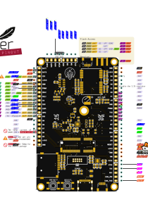
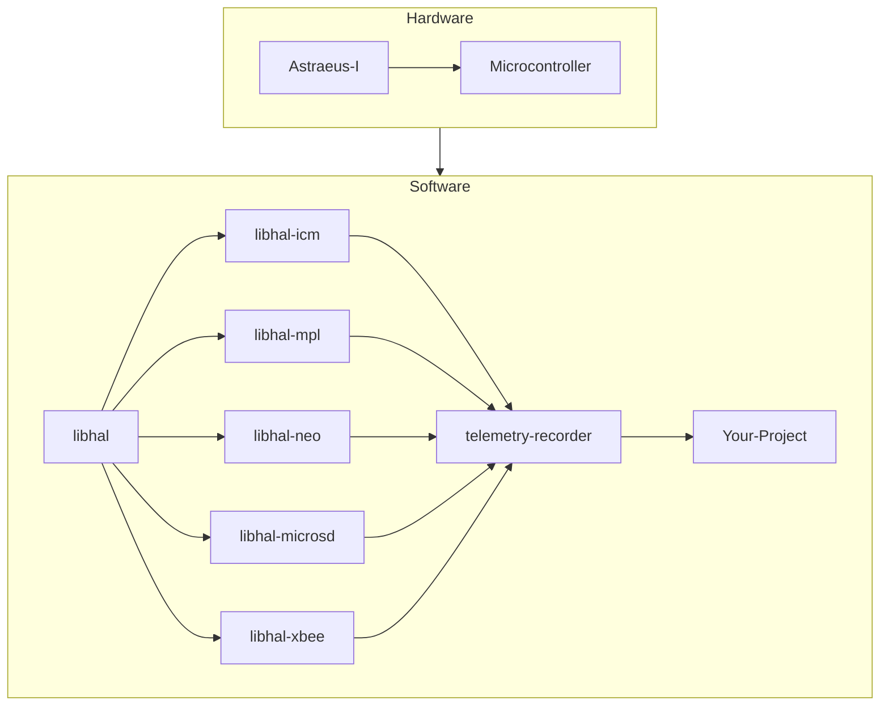
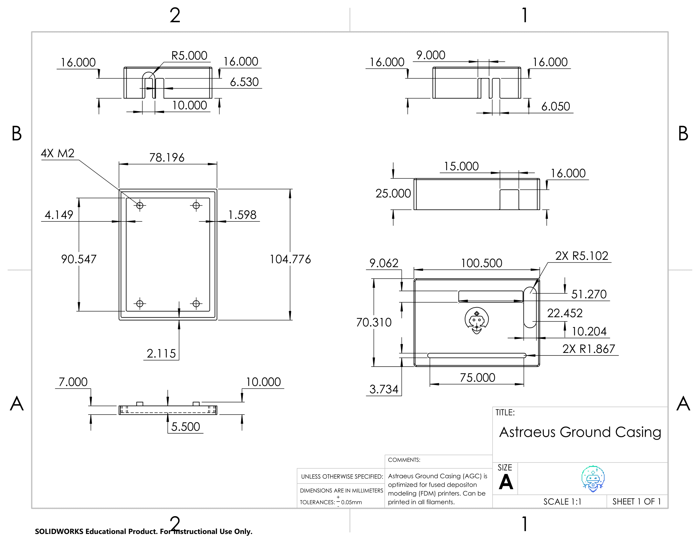

# 📖 User Guide

## 🧱 Fundamentals of Astraeus-I
The Astraeus-I board is ingeniously crafted for high modularity in both hardware and software, making it an ideal choice for avionic system applications. Its standout feature is the micromod - a compact and interchangeable microprocessor board that allows you to customize the microcontroller according to your project requirements. The board comes equipped with a variety of sensors and peripherals, enhancing its utility and versatility. These include:

- A sophisticated 9 Degrees of Freedom IMU (ICM-20948)
- A highly accurate Barometer (MPL3115A2)
- A dependable GPS module (Neo-m9n)
- An SD Card slot for convenient data storage

In terms of software, the Astraeus-I boasts a comprehensive suite, including specific device drivers for each onboard component. These drivers are integral to the functionality of the telemetry recorder and the board application package. The telemetry recorder is adept at capturing data from the onboard devices, offering the flexibility to store this data on the SD card or, if equipped, to transmit it via a radio module. While the board doesn't come with an Xbee radio module, it's designed to accommodate one should you choose to enhance its capabilities - a possibility you can explore further in the order form. The board application package is another significant feature, enabling the running of custom applications on the board. This allows for precise control over the onboard devices and the execution of customized actions, providing a robust platform for developing tailored applications.

## 🔩 Hardware Details

To connect the Astraeus-I board with other devices, start by referencing the pinout diagram or the clearly labeled pins on the board itself. This will guide you in identifying the exact pins required for your connection. Once you have this information, match these pins with the corresponding ones on the device you're connecting to, using its pinout diagram as a reference. The Astraeus-I board is equipped with a variety of features including a 9 DOF IMU (ICM-20948), a Barometer (MPL3115A2), GPS (Neo-m9n), an SD Card slot, and it even supports the installation of an xbee radio module. Another key feature of this board is its micromod connector, which allows for easy swapping of the microcontroller, adding a layer of versatility to your projects.

### 📌 Pinout Diagram




### 🛠️ Board Specifications
- **Dimensions**
    - 52 mm x 85 mm
    - Horizontal Mounting Hole Distance: 46.1 mm
    - Vertical Mounting Hole Distance: 78.87 mm
- **Weight**
    - 22 grams (without header pins)
- **Power**
    - Supply voltage:  5V
    - Operating current: 200mA

!!! note
    For detailed information on the Astraeus board's schematic and board layout, refer to the <a href="https://github.com/Astraeus-I/Astraeus-I-Board" target="_blank">Astraeus-I Board repository</a>


## 💻 Software Details

The board’s software includes device drivers for onboard devices, board application tools. Device drivers facilitate interaction with the onboard devices and are utilized by the board application tools. The telemetry recorder, a pivotal tool within the suite, captures data from the devices, offering options to either save this data to an SD card or transmit it through a radio module if one is present on the board. Concurrently, the board application tools empowers users to run custom applications on the board. These applications can manipulate the onboard devices and execute custom actions, providing a versatile foundation for developing your own applications.

Here is a diagram of the software architecture of the board:
<div align="center">


</div>
To get a better understanding of the libhal software organization visit the <a href="https://libhal.github.io/2.2/contributor_guide/organization/#target-libraries" target="_blank">libhal organization</a>.


## ⚙️ Configuration

### 🔓 Full Modularity

Astraeus-I boasts a fully modular design, offering unparalleled flexibility to its users. This means that individuals can effortlessly customize their setup by adding new devices or swapping out existing ones based on their evolving requirements. Such a design ensures that the board remains adaptable and future-proof, accommodating both current needs and potential future expansions. Whether you're aiming to integrate the latest devices or reconfigure your setup for a specific application, the Astraeus-I board's modular architecture empowers you to do so with ease and efficiency.

### 🔗 Connecting New Devices
🚧 Under construction 🚧

The Astraeus-I board is equipped with two Qwiic connectors, designed to facilitate effortless integration of additional device modules. This feature not only allows for straightforward singular module attachments but also supports daisy chaining, letting users link multiple modules in sequence. This capability ensures scalable expansions, enabling users to customize and augment the board's functionalities as per their requirements. Whether you're aiming for simple additions or building a more intricate system requring additional sensors, the Qwiic connectors on the Astraeus-I board make the process seamless and user-friendly.

### 🔨 Adding Tools

If you'd like to add a device or tool to your project you can do so by adding it to the conanfile.py file. You can find the conanfile.py file in the root directory of your project. The conanfile.py file is used to specify the dependencies of your project. To add a device or tool to your project you will need to add it to the `requirements` list in the conanfile.py file. For example, if you want to add the telemetry recorder tool to your project you would add it to the `requirements` list like this:

```python
def requirements(self):
    if str(self.options.platform).startswith("lpc40"):
        self.requires("libhal-lpc40/[^2.1.1]")
    self.requires("telemetry-recorder/0.0.1")
    self.requires("libhal-util/[^3.0.0]")
```
!!! note 
    Check out the <a href="https://github.com/Astraeus-I/telemetry-recorder" target="_blank">telemetry recorder</a> tool if you want to record data from the Astraeus-I board.


## ⌨ Development Tools

Astraeus-I provides a comprehensive range of sophisticated yet accessible tools, tailored for both professional and hobbyist needs, ensuring deep insights and effective utilization of the board's capabilities. This includes intuitive software for real-time data monitoring, advanced PCB design resources, and customizable mechanical cases for physical protection and functional optimization. These tools collectively offer a seamless experience, from detailed data analysis to practical application, enhancing both the understanding and practical usage of the Astraeus-I board.

### 💻 Software Tools

#### 📋 Web Serial

Experience seamless board testing with libhals intuitive <a href="https://libhal.github.io/web-serial/" target="_blank">Web Serial Interface</a>. Simply connect the development board to your laptop or PC via a USB and watch real-time data transmissions unfold on your screen. This feature not only provides immediate insights into the board's performance and metrics but also ensures that any necessary calibrations or diagnostics can be performed effortlessly. Perfect for both developers and enthusiasts, our web-based serial connection offers a user-friendly gateway to understanding and harnessing the power of the avionics board.

### 🔧 Hardware Tools

#### 🪛 PCB Design

We have used <a href="https://easyeda.com/" target="_blank">EasyEDA</a>, a free online PCB design tool, to design the Astraeus-I board. EasyEDA is a free, zero-install, cloud-based EDA tool, designed to facilitate seamless PCB design and collaboration. This tool offers a wide range of features including schematic capture, spice simulation, PCB layout, and PCB order. EasyEDA also provides a comprehensive library of over 1 million components, ensuring that users have access to a diverse range of components to choose from. The tool's intuitive interface and user-friendly features make it an ideal choice for both beginners and professionals alike.

### 🏰 Mechanical Cases

The Astraeus-I board is tailored to be housed within a 3D-printed enclosure. Theses enclosures are crafted to safeguard the board against external harm while maintaining stability and security. It is thoughtfully engineered to allow straightforward access to the board's ports and connectors, enabling hassle-free connections and disconnections of devices. There are two versions of the case: one suited for internal, non-aerodynamic applications, and another optimized for aerodynamic uses.


#### Astraeus Ground Case - <a href="../../downloads/AstraeusAeroCase.zip" download>Download ZIP</a>
Designed by [Alberto Meunier](https://www.linkedin.com/in/alberto-meunier)

This cases are intended to be fabricated using any filament for an FDM printer in a 3D printing process.



<button id="toggle-model-top" class="underline-button">View 3D Top Design</button>
<div id="astra_ground_top" style="width: 600px; height: 400px; display: none;"></div>

<button id="toggle-model-bottom" class="underline-button">View 3D Bottom Design</button>
<div id="astra_ground_bottom" style="width: 600px; height: 400px; display: none;"></div>

<!-- Include Three.js and other necessary scripts -->
<script src="https://cdn.jsdelivr.net/npm/three@0.140.0/build/three.min.js"></script>
<script src="https://cdn.jsdelivr.net/npm/three@0.140.0/examples/js/loaders/STLLoader.js"></script>
<script src="https://cdn.jsdelivr.net/npm/three@0.140.0/examples/js/controls/OrbitControls.js"></script>


<script>
    let viewers = [];

    function getAssetPath(fileName) {
        const isLocal = window.location.hostname === 'localhost' || window.location.hostname === '127.0.0.1';
        return isLocal ? `../../assets/${fileName}` : `https://raw.githubusercontent.com/Astraeus-I/Astraeus-I.github.io/main/docs/assets/${fileName}`;
    }

    function setupSTLViewer(containerId, stlFileName) {
        let camera, scene, renderer, controls, mesh;
        let isUserInteracting = false, idleTime = 0, autoRotateSpeed = 0.3;
        const container = document.getElementById(containerId);

        initSTLViewer();
        window.addEventListener('resize', () => onWindowResize(containerId), false);

        function initSTLViewer() {
            scene = new THREE.Scene();
            scene.background = new THREE.Color(0xEEEEEE); // Changed background color

            camera = new THREE.PerspectiveCamera(75, container.offsetWidth / container.offsetHeight, 0.1, 1000);
            camera.position.set(10, 10, 20);

            renderer = new THREE.WebGLRenderer({ antialias: true });
            renderer.setSize(container.offsetWidth, container.offsetHeight);
            container.appendChild(renderer.domElement);

            controls = new THREE.OrbitControls(camera, renderer.domElement);
            controls.minDistance = 5;
            controls.maxDistance = 50;

            const gridHelper = new THREE.GridHelper(200, 50); // Added grid helper
            scene.add(gridHelper);

            const loader = new THREE.STLLoader();
            loader.load(getAssetPath(stlFileName), function (geometry) {
                const material = new THREE.MeshPhongMaterial({ color: 0x87CEEB, specular: 0x111111, shininess: 100 });
                mesh = new THREE.Mesh(geometry, material);
                geometry.translate(-50, 0, -50);

                mesh.scale.set(0.1, 0.1, 0.1);
                scene.add(mesh);

                camera.lookAt(mesh.position);
                controls.target.set(0, 0, 0);

                animate();
                controls.target.copy(mesh.position);

            });

            addLights();
        }

    function animate() {
        requestAnimationFrame(animate);

        if (!isUserInteracting) {
            idleTime += 0.01;
            if (idleTime > 5) { // 5 seconds of inactivity
                // Auto-rotate camera around the object
                const radius = 15; // Define the radius of the circular path
                camera.position.x = mesh.position.x + Math.cos(idleTime * autoRotateSpeed) * radius;
                camera.position.z = mesh.position.z + Math.sin(idleTime * autoRotateSpeed) * radius;
                camera.lookAt(mesh.position); // Make sure the camera always looks at the mesh
            }
        }

        controls.update();
        renderer.render(scene, camera);
    }

        function addLights() {
            const ambientLight = new THREE.AmbientLight(0x404040);
            scene.add(ambientLight);
            const directionalLight = new THREE.DirectionalLight(0xffffff, 0.5);
            directionalLight.position.set(1, 1, 1);
            scene.add(directionalLight);
        }

        viewers.push({ container, camera, renderer, scene });

        // Reset idle time on user interaction
        container.addEventListener('mousemove', () => {
            isUserInteracting = true;
            idleTime = 0;
        });
        container.addEventListener('mouseleave', () => isUserInteracting = false);
    }

    function onWindowResize(containerId) {
        const viewer = viewers.find(v => v.container.id === containerId);
        if (viewer) {
            viewer.camera.aspect = viewer.container.offsetWidth / viewer.container.offsetHeight;
            viewer.camera.updateProjectionMatrix();
            viewer.renderer.setSize(viewer.container.offsetWidth, viewer.container.offsetHeight);
        }
    }

    document.getElementById('toggle-model-top').addEventListener('click', function() {
        toggleVisibility('astra_ground_top');
    });

    document.getElementById('toggle-model-bottom').addEventListener('click', function() {
        toggleVisibility('astra_ground_bottom');
    });

    function toggleVisibility(containerId) {
        const container = document.getElementById(containerId);
        const isVisible = container.style.display !== 'none';
        container.style.display = isVisible ? 'none' : 'block';

        if (!isVisible) {
            onWindowResize(containerId);
        }
    }

    // Initialize viewers for each STL file
    setupSTLViewer('astra_ground_top', 'AstraeusGroundCasingTop.STL');
    setupSTLViewer('astra_ground_bottom', 'AstraeusGroundCasingBottom.STL');
</script>
